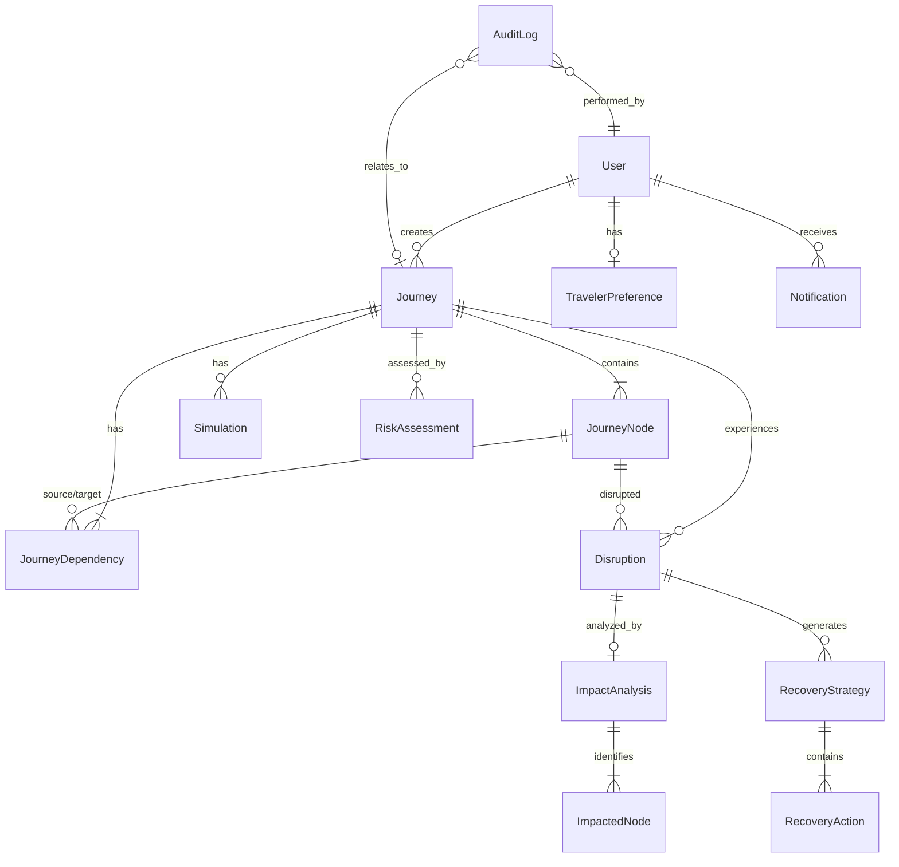

# TripShield AI — Database Documentation

## Overview

TripShield AI uses SQLAlchemy 2.0 ORM with SQLite for development and PostgreSQL for production. The schema is designed for referential integrity, proper indexing, and clear domain separation.

## Entity Relationship Diagram

## Tables

### users
| Column | Type | Constraints |
|--------|------|-------------|
| id | VARCHAR(36) | PRIMARY KEY |
| email | VARCHAR(255) | UNIQUE, NOT NULL |
| password_hash | VARCHAR(255) | NOT NULL |
| full_name | VARCHAR(255) | NOT NULL |
| phone | VARCHAR(50) | NULLABLE |
| role | VARCHAR(20) | DEFAULT 'traveler' |
| is_active | BOOLEAN | DEFAULT TRUE |
| created_at | DATETIME | DEFAULT NOW |
| updated_at | DATETIME | DEFAULT NOW |

### traveler_preferences
| Column | Type | Constraints |
|--------|------|-------------|
| id | VARCHAR(36) | PRIMARY KEY |
| user_id | VARCHAR(36) | FK → users.id, UNIQUE |
| budget_priority | INTEGER | DEFAULT 50 (0-100) |
| speed_priority | INTEGER | DEFAULT 70 |
| comfort_priority | INTEGER | DEFAULT 60 |
| minimal_changes_priority | INTEGER | DEFAULT 50 |
| preferred_airlines | JSON | NULLABLE |
| preferred_transport | JSON | NULLABLE |
| max_connections | INTEGER | DEFAULT 2 |
| preferred_hotel_category | VARCHAR(50) | NULLABLE |
| accessibility_requirements | JSON | NULLABLE |
| important_activities | JSON | NULLABLE |
| non_negotiable_bookings | JSON | NULLABLE |
| updated_at | DATETIME | DEFAULT NOW |

### journeys
| Column | Type | Constraints |
|--------|------|-------------|
| id | VARCHAR(36) | PRIMARY KEY |
| user_id | VARCHAR(36) | FK → users.id |
| title | VARCHAR(255) | NOT NULL |
| description | TEXT | NULLABLE |
| origin | VARCHAR(255) | NOT NULL |
| destination | VARCHAR(255) | NOT NULL |
| start_date | DATETIME | NOT NULL |
| end_date | DATETIME | NOT NULL |
| status | VARCHAR(20) | DEFAULT 'draft' |
| resilience_score | INTEGER | NULLABLE |
| metadata | JSON | NULLABLE |
| is_demo | BOOLEAN | DEFAULT FALSE |
| created_at | DATETIME | DEFAULT NOW |
| updated_at | DATETIME | DEFAULT NOW |

### journey_nodes
| Column | Type | Constraints |
|--------|------|-------------|
| id | VARCHAR(36) | PRIMARY KEY |
| journey_id | VARCHAR(36) | FK → journeys.id |
| type | VARCHAR(30) | NOT NULL |
| provider | VARCHAR(255) | NULLABLE |
| location | VARCHAR(255) | NULLABLE |
| latitude | FLOAT | NULLABLE |
| longitude | FLOAT | NULLABLE |
| destination_location | VARCHAR(255) | NULLABLE |
| dest_latitude | FLOAT | NULLABLE |
| dest_longitude | FLOAT | NULLABLE |
| start_time | DATETIME | NOT NULL |
| end_time | DATETIME | NOT NULL |
| status | VARCHAR(20) | DEFAULT 'confirmed' |
| cost | FLOAT | DEFAULT 0 |
| currency | VARCHAR(10) | DEFAULT 'INR' |
| booking_reference | VARCHAR(100) | NULLABLE |
| cancellation_policy | JSON | NULLABLE |
| flexibility | VARCHAR(20) | DEFAULT 'low' |
| importance | VARCHAR(20) | DEFAULT 'medium' |
| traveler_preference_weight | FLOAT | DEFAULT 1.0 |
| details | JSON | NULLABLE |
| sequence_order | INTEGER | DEFAULT 0 |
| created_at | DATETIME | DEFAULT NOW |
| updated_at | DATETIME | DEFAULT NOW |

### journey_dependencies
| Column | Type | Constraints |
|--------|------|-------------|
| id | VARCHAR(36) | PRIMARY KEY |
| journey_id | VARCHAR(36) | FK → journeys.id |
| source_node_id | VARCHAR(36) | FK → journey_nodes.id |
| target_node_id | VARCHAR(36) | FK → journey_nodes.id |
| relationship_type | VARCHAR(30) | NOT NULL |
| buffer_minutes | INTEGER | DEFAULT 60 |
| is_critical | BOOLEAN | DEFAULT TRUE |
| metadata | JSON | NULLABLE |

### disruptions
| Column | Type | Constraints |
|--------|------|-------------|
| id | VARCHAR(36) | PRIMARY KEY |
| journey_id | VARCHAR(36) | FK → journeys.id |
| affected_node_id | VARCHAR(36) | FK → journey_nodes.id |
| type | VARCHAR(50) | NOT NULL |
| severity | VARCHAR(20) | NULLABLE |
| description | TEXT | NULLABLE |
| delay_minutes | INTEGER | DEFAULT 0 |
| is_simulated | BOOLEAN | DEFAULT TRUE |
| status | VARCHAR(30) | DEFAULT 'detected' |
| detected_at | DATETIME | DEFAULT NOW |
| resolved_at | DATETIME | NULLABLE |
| metadata | JSON | NULLABLE |

### impact_analyses
| Column | Type | Constraints |
|--------|------|-------------|
| id | VARCHAR(36) | PRIMARY KEY |
| disruption_id | VARCHAR(36) | FK → disruptions.id |
| journey_id | VARCHAR(36) | FK → journeys.id |
| impact_score | INTEGER | NOT NULL (0-100) |
| severity_class | VARCHAR(20) | NOT NULL |
| nodes_affected | INTEGER | NOT NULL |
| financial_exposure | FLOAT | DEFAULT 0 |
| currency | VARCHAR(10) | DEFAULT 'INR' |
| time_impact_minutes | INTEGER | DEFAULT 0 |
| scoring_breakdown | JSON | NULLABLE |
| affected_nodes_detail | JSON | NULLABLE |
| analyzed_at | DATETIME | DEFAULT NOW |

### impacted_nodes
| Column | Type | Constraints |
|--------|------|-------------|
| id | VARCHAR(36) | PRIMARY KEY |
| impact_analysis_id | VARCHAR(36) | FK → impact_analyses.id |
| node_id | VARCHAR(36) | FK → journey_nodes.id |
| impact_type | VARCHAR(20) | NOT NULL (direct/indirect) |
| reason | TEXT | NULLABLE |
| severity_contribution | INTEGER | DEFAULT 0 |

### recovery_strategies
| Column | Type | Constraints |
|--------|------|-------------|
| id | VARCHAR(36) | PRIMARY KEY |
| disruption_id | VARCHAR(36) | FK → disruptions.id |
| journey_id | VARCHAR(36) | FK → journeys.id |
| title | VARCHAR(255) | NOT NULL |
| description | TEXT | NULLABLE |
| changed_components | JSON | NULLABLE |
| preserved_components | JSON | NULLABLE |
| additional_cost | FLOAT | DEFAULT 0 |
| currency | VARCHAR(10) | DEFAULT 'INR' |
| time_saved_minutes | INTEGER | DEFAULT 0 |
| num_changes | INTEGER | DEFAULT 0 |
| feasibility_score | FLOAT | DEFAULT 0 |
| comfort_score | FLOAT | DEFAULT 0 |
| urgency_score | FLOAT | DEFAULT 0 |
| financial_impact_score | FLOAT | DEFAULT 0 |
| recovery_confidence | FLOAT | DEFAULT 0 |
| overall_score | FLOAT | DEFAULT 0 |
| explanation | TEXT | NULLABLE |
| is_recommended | BOOLEAN | DEFAULT FALSE |
| rank | INTEGER | DEFAULT 0 |
| status | VARCHAR(20) | DEFAULT 'proposed' |
| actions_detail | JSON | NULLABLE |
| created_at | DATETIME | DEFAULT NOW |

### recovery_actions
| Column | Type | Constraints |
|--------|------|-------------|
| id | VARCHAR(36) | PRIMARY KEY |
| strategy_id | VARCHAR(36) | FK → recovery_strategies.id |
| original_node_id | VARCHAR(36) | FK → journey_nodes.id, NULLABLE |
| replacement_node_id | VARCHAR(36) | FK → journey_nodes.id, NULLABLE |
| action_type | VARCHAR(20) | NOT NULL |
| description | TEXT | NULLABLE |
| old_details | JSON | NULLABLE |
| new_details | JSON | NULLABLE |
| cost_difference | FLOAT | DEFAULT 0 |
| status | VARCHAR(20) | DEFAULT 'pending' |
| executed_at | DATETIME | NULLABLE |

### notifications
| Column | Type | Constraints |
|--------|------|-------------|
| id | VARCHAR(36) | PRIMARY KEY |
| user_id | VARCHAR(36) | FK → users.id |
| journey_id | VARCHAR(36) | FK → journeys.id, NULLABLE |
| type | VARCHAR(50) | NOT NULL |
| title | VARCHAR(255) | NOT NULL |
| message | TEXT | NULLABLE |
| priority | VARCHAR(20) | DEFAULT 'medium' |
| is_read | BOOLEAN | DEFAULT FALSE |
| metadata | JSON | NULLABLE |
| created_at | DATETIME | DEFAULT NOW |

### audit_logs
| Column | Type | Constraints |
|--------|------|-------------|
| id | VARCHAR(36) | PRIMARY KEY |
| user_id | VARCHAR(36) | FK → users.id, NULLABLE |
| journey_id | VARCHAR(36) | FK → journeys.id, NULLABLE |
| event_type | VARCHAR(100) | NOT NULL |
| description | TEXT | NULLABLE |
| details | JSON | NULLABLE |
| ip_address | VARCHAR(45) | NULLABLE |
| created_at | DATETIME | DEFAULT NOW |

### simulations
| Column | Type | Constraints |
|--------|------|-------------|
| id | VARCHAR(36) | PRIMARY KEY |
| journey_id | VARCHAR(36) | FK → journeys.id |
| user_id | VARCHAR(36) | FK → users.id |
| disruption_type | VARCHAR(50) | NOT NULL |
| parameters | JSON | NULLABLE |
| impact_result | JSON | NULLABLE |
| recovery_options | JSON | NULLABLE |
| resilience_score_before | INTEGER | NULLABLE |
| resilience_score_after | INTEGER | NULLABLE |
| status | VARCHAR(20) | DEFAULT 'running' |
| created_at | DATETIME | DEFAULT NOW |

### risk_assessments
| Column | Type | Constraints |
|--------|------|-------------|
| id | VARCHAR(36) | PRIMARY KEY |
| journey_id | VARCHAR(36) | FK → journeys.id |
| node_id | VARCHAR(36) | FK → journey_nodes.id, NULLABLE |
| weather_risk | FLOAT | DEFAULT 0 |
| delay_history_risk | FLOAT | DEFAULT 0 |
| congestion_risk | FLOAT | DEFAULT 0 |
| connection_buffer_risk | FLOAT | DEFAULT 0 |
| route_risk | FLOAT | DEFAULT 0 |
| provider_reliability | FLOAT | DEFAULT 0 |
| overall_risk | FLOAT | DEFAULT 0 |
| risk_level | VARCHAR(20) | NULLABLE |
| explanation | TEXT | NULLABLE |
| is_simulated | BOOLEAN | DEFAULT TRUE |
| assessed_at | DATETIME | DEFAULT NOW |

### providers
| Column | Type | Constraints |
|--------|------|-------------|
| id | VARCHAR(36) | PRIMARY KEY |
| name | VARCHAR(255) | NOT NULL |
| type | VARCHAR(50) | NOT NULL |
| is_mock | BOOLEAN | DEFAULT TRUE |
| api_endpoint | VARCHAR(500) | NULLABLE |
| config | JSON | NULLABLE |
| status | VARCHAR(20) | DEFAULT 'active' |
| last_health_check | DATETIME | NULLABLE |

## Indexes

- `users.email` — UNIQUE index
- `journeys.user_id` — for user's journey queries
- `journey_nodes.journey_id` — for journey's nodes
- `journey_dependencies.journey_id` — for journey's deps
- `disruptions.journey_id` — for journey's disruptions
- `notifications.user_id` — for user's notifications
- `audit_logs.journey_id` — for journey audit trail
- `audit_logs.created_at` — for time-based queries

## JSON Usage Policy

JSON columns are used ONLY for:
1. **Provider-specific details** (flight_number, hotel_name, etc.) — varies by node type
2. **Cancellation policies** — complex, nested structure
3. **Scoring breakdowns** — detailed calculation results
4. **Preferences lists** (airlines, activities) — variable-length arrays
5. **Simulation results** — snapshot of computation results

Structured, queryable data uses proper relational columns.
